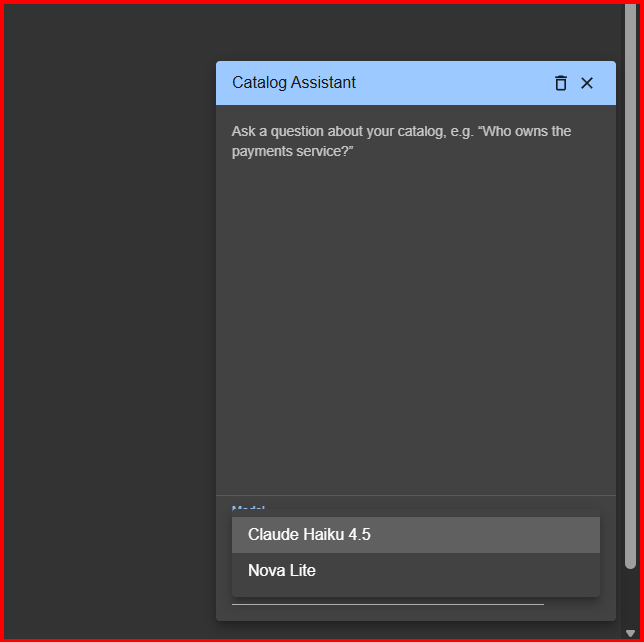

# Catalog Assistant (frontend)

Backstage **frontend** plugin for the catalog assistant: a page with a question
prompt, a **model dropdown** (populated from the backend allowlist), and the
grounded answer with entity-ref **citations**.

Pairs with [`@theplatformlog/catalog-assistant-backend`](../../packages/catalog-assistant-backend) —
the frontend just calls that plugin's `GET /v1/models` and `POST /v1/query`.



> ⚠️ **This package lives outside the backend monorepo's `packages/*` workspace
> on purpose** — this repo has no frontend toolchain, so the code here is **not
> built or type-checked by this repo's CI**. Build and run it inside a Backstage
> app (which has `@backstage/cli` + React + Material UI). See "Install" below.

## Where the UI appears

Two options — pick one (or both):

- **Floating chat widget (recommended when the sidebar is full):** a bubble in
  the **bottom-right** that opens a chat panel with the model dropdown. Mounted
  once globally — no sidebar item, appears on every page.
- **Standalone page + sidebar item:** a full page reached from a new left-nav
  entry. Use this if you have room in the sidebar.

> The chat is multi-turn: it keeps the conversation **per browser session**
> (persisted in `sessionStorage`), sends prior turns to the backend so
> follow-ups like "who owns it?" work, and a **Clear** button resets it.

## Install (into your Backstage app)

The most reliable path — let the Backstage CLI generate the package shell with
versions that match your app, then drop these source files in:

```bash
# from your Backstage app root
yarn new --select plugin   # name it "catalog-assistant"; creates plugins/catalog-assistant
# then copy this folder's src/ over plugins/catalog-assistant/src/
```

Or copy this whole folder into `plugins/catalog-assistant/` and align the
dependency versions in `package.json` with your app's other plugins
(see `packages/app/package.json`). Then:

```bash
yarn --cwd packages/app add @theplatformlog/catalog-assistant
```

## Wire it up

### Option A — floating chat widget (two edits)

**1. Register the plugin** in `packages/app/src/App.tsx`. The chat widget is not
on a route, so `createApp` won't auto-discover the plugin — without this you get
`NotImplementedError: No implementation available for apiRef{plugin.catalog-assistant.service}`:

```tsx
import { catalogAssistantPlugin } from '@theplatformlog/catalog-assistant';

const app = createApp({
  apis,
  plugins: [catalogAssistantPlugin], // <-- add this
  bindRoutes({ bind }) { /* ... */ },
});
```

**2. Mount the widget** once in your app's root so it floats on every page. In
`packages/app/src/components/Root/Root.tsx`, render it next to `{children}`:

```tsx
import { CatalogAssistantChat } from '@theplatformlog/catalog-assistant';

export const Root = ({ children }: PropsWithChildren<{}>) => (
  <SidebarPage>
    <Sidebar>{/* ...existing sidebar items, unchanged... */}</Sidebar>
    {children}
    <CatalogAssistantChat />
  </SidebarPage>
);
```

No route and no sidebar item needed — the bubble appears bottom-right on every
page. (Option B's routable page auto-registers the plugin, so it doesn't need
step 1; the chat widget does because it's mounted outside the routes.)

### Option B — standalone page + sidebar item (two edits)

**1. Add the route** — `packages/app/src/App.tsx`, inside `<FlatRoutes>`:

```tsx
import { CatalogAssistantPage } from '@theplatformlog/catalog-assistant';

// ...
<Route path="/catalog-assistant" element={<CatalogAssistantPage />} />
```

**2. Add the sidebar item** — `packages/app/src/components/Root/Root.tsx`,
where the other `<SidebarItem>`s are:

```tsx
import QuestionAnswerIcon from '@material-ui/icons/QuestionAnswer';

<SidebarItem icon={QuestionAnswerIcon} to="catalog-assistant" text="Ask Catalog" />
```

## Backend prerequisite

Install and configure `@theplatformlog/catalog-assistant-backend` (provider,
model, and — for the dropdown — the `models` allowlist). The frontend reads
whatever models that backend reports as enabled.

## Verify

`yarn start` your app. For the chat widget (Option A), click the **bubble in the
bottom-right**, pick a model, ask a question, and confirm the answer + citations
render. For the page (Option B), open the **Ask Catalog** sidebar item instead.
