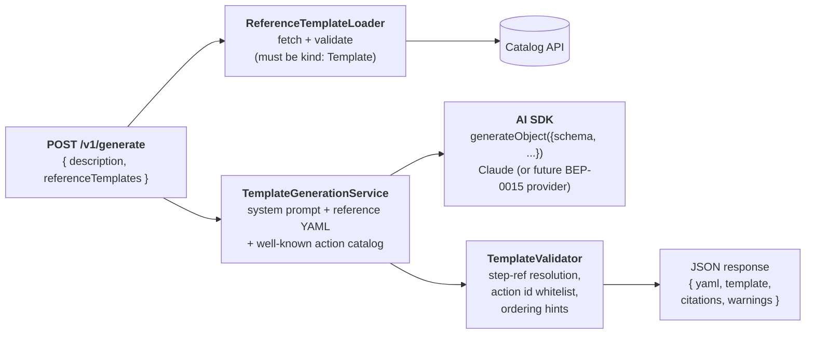

# Template Authoring Backend

A Backstage backend plugin that generates scaffolder `Template` entities
from a natural-language description, grounded on optional reference
templates pulled from the catalog and constrained by a curated catalog of
well-known scaffolder actions.

Ask things like:

> _"A Node.js microservice with Express, OpenTelemetry tracing, and GitHub Actions CI"_

…and get back a runnable v1beta3 Template YAML with the right steps in the
right order, declared parameters where the action inputs need user data,
and entity-ref citations for the reference templates and actions the
generator used.

## Status

First slice. Backend HTTP endpoint only, no UI. Uses the AI SDK
`generateObject` helper with a zod schema so the LLM is forced to emit a
valid Template structure — not just freeform YAML it claims is valid.

## Installation

```bash
yarn --cwd packages/backend add @backstage/plugin-template-authoring-backend
```

Register the plugin:

```ts
// packages/backend/src/index.ts
backend.add(import('@theplatformlog/template-authoring-backend'));
```

## Configuration

```yaml
templateAuthoring:
  # LLM provider: anthropic (default) | openai | google | mistral
  provider: anthropic
  # Model id for the chosen provider. Defaults to 'claude-opus-4-8'
  # for anthropic; required for any other provider.
  model: claude-opus-4-8
  # API key for the provider. If omitted, the provider SDK reads its
  # conventional env var (ANTHROPIC_API_KEY, OPENAI_API_KEY, etc.).
  apiKey: ${ANTHROPIC_API_KEY}
  # Defaults to 3
  maxReferenceTemplates: 3
  # Used when the LLM omits spec.owner. Defaults to 'group:default/unowned'.
  defaultOwner: group:default/platform
```

### Using a non-Anthropic provider

`@ai-sdk/anthropic` ships with this plugin. To use another provider, install
its Vercel AI SDK package in your backend and set `provider` + `model`:

```bash
yarn --cwd packages/backend add @ai-sdk/openai
```

```yaml
templateAuthoring:
  provider: openai
  model: gpt-5
  apiKey: ${OPENAI_API_KEY}
```

Supported providers: `anthropic`, `openai`, `google`, `mistral`. Note that
template generation relies on structured output (`generateObject`); pick a
model on your provider that supports it.

## API

### `POST /api/template-authoring/v1/generate`

Request:

```json
{
  "description": "A Node.js microservice with Express, structured logging, and GitHub Actions CI",
  "referenceTemplates": ["template:default/nodejs-service-base"]
}
```

`referenceTemplates` is optional. If supplied, each entity ref is fetched
from the catalog and embedded in the user prompt as an example of the
desired step layout — but the model is instructed not to copy them
verbatim.

Response:

```json
{
  "yaml": "apiVersion: scaffolder.backstage.io/v1beta3\nkind: Template\n...",
  "template": { "apiVersion": "scaffolder.backstage.io/v1beta3", "kind": "Template", ... },
  "citations": {
    "referenceTemplates": ["template:default/nodejs-service-base"],
    "actionsUsed": ["fetch:template", "publish:github", "catalog:register"]
  },
  "warnings": [
    "first step uses 'catalog:register'; templates typically start with a fetch:* step to populate the workspace"
  ]
}
```

Authentication uses the standard Backstage `httpAuth` service and accepts
either a user or service credential. The credential token (if any) is
forwarded to the catalog when fetching reference templates so per-user
visibility filters are honoured.

## Architecture



### Why `generateObject` and not `generateText`?

If you ask an LLM for "YAML" you sometimes get back markdown code fences,
sometimes get back commentary around the YAML, sometimes get back invalid
YAML that needs re-parsing. `generateObject` constrains the response to
JSON that conforms to a zod schema — for Backstage Templates, JSON and
YAML are equivalent, so we emit JSON from the model and YAML to the
caller via `yaml.stringify`.

The schema enforces:

- `apiVersion === 'scaffolder.backstage.io/v1beta3'`
- `kind === 'Template'`
- `metadata.name` matches the kebab-case regex Backstage uses
- `spec.steps[].action` is one of the curated whitelist of known action ids
- `spec.steps` is non-empty

### Why a curated action catalog?

In v1 the well-known action catalog is a [static list](./src/services/wellKnownActions.ts).
The plugin runs without having to wire into another plugin's runtime
`ActionsRegistry`. A future revision should source this from the actual
registry so the model only ever sees actions that the host backend has
loaded — including third-party actions like `mcp:call` from the companion
[`scaffolder-backend-module-mcp`](../scaffolder-backend-module-mcp/) plugin.

### Semantic validation beyond the schema

`TemplateValidator` runs three checks that the zod schema can't:

1. **Step reference resolution.** Any `${{ steps.X.... }}` expression in
   a step input or `spec.output` must point at a step id declared earlier
   in the template.
2. **Action id whitelist** (double-check). zod already enforces this at
   the type level, but the validator catches the case where the schema
   is relaxed in a future revision.
3. **Ordering hints.** First step is normally a `fetch:*`. `catalog:register`
   normally comes after `publish:*`. These surface as warnings, not
   exceptions — opinionated patterns, not hard rules.

Failures are returned alongside the template as a `warnings[]` field; the
caller decides whether to surface them. This keeps the endpoint useful
during early iteration even when the model produces something slightly
off.

## Where this fits

Third plugin in the AI-on-Backstage series:

1. **`scaffolder-backend-module-mcp`** — Backstage as MCP client for
   scaffolder templates.
2. **`catalog-assistant-backend`** — grounded LLM Q&A over the Software
   Catalog.
3. **`template-authoring-backend`** — generate scaffolder Templates from
   natural language (this plugin).

Each composes the same AI-SDK shape, so all three swap behind the
[BEP-0015 AI Model Provider Service](https://github.com/backstage/backstage/pull/33906)
when it lands with a contained refactor.

## Limitations

- **No self-correction pass yet.** If the model produces a template whose
  step refs don't resolve, the warnings come back to the caller — we
  don't re-prompt the model to fix it. Worth adding once the average
  failure mode is well-understood.
- **No frontend.** A separate `plugin-template-authoring` (frontend) is
  the natural follow-on for the scaffolder Templates page.
- **Curated action catalog.** Not yet sourced from a live `ActionsRegistry` —
  see the rationale above.
- **One-shot.** No conversation memory, no iterative refinement turn.
